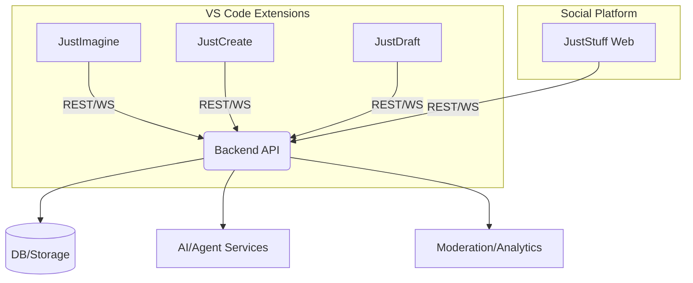
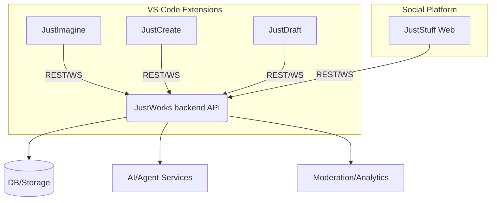
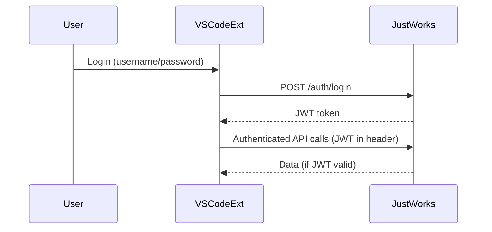
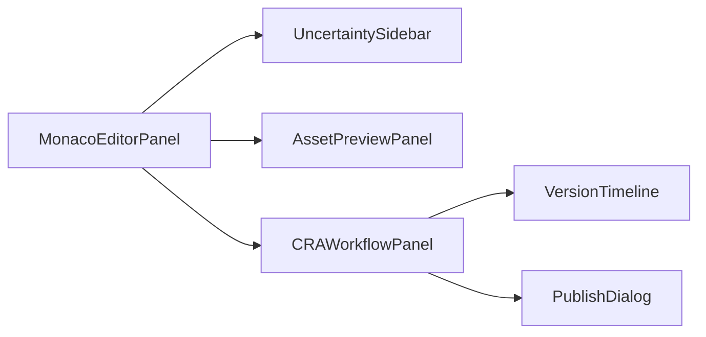

# Comprehensive Design Document for the JustCreate Ecosystem

*(Aspirational Domain: Just.cool – pending acquisition)*

---

## Executive Summary

---

The **JustCreate Ecosystem** is a modular suite of VS Code extensions and cloud services that empowers users to transform raw ideas into refined creative assets, collaborate in real time, and share results effortlessly. The MVP focuses on the "JustCreate" extension, enabling users to write in plain English, leverage AI-powered suggestions, and manage creative blueprints with seamless versioning—all within a secure, extensible platform. JustImagine (idea capture) and JustDraft (versioning) are tightly integrated, with social sharing (JustStuff) and robust cloud APIs (JustWorks) available for advanced workflows.

**MVP Deliverables:**
- Endpoints: `/api/v1/blueprints`, `/api/v1/assets`, `/api/v1/drafts`, `/api/v1/ai/structure` (JustWorks backend)
- UI Panels: Monaco JustEnglish editor, CRA workflow, asset preview, publish dialog
- Features: Compose/Resolve/Answer loop, uncertainty highlighting, AI suggest, save/load blueprints, basic publish to JustStuff, JWT auth
- **Cross-Platform Requirement:** JustStuff MVP must support both mobile and desktop platforms simultaneously (responsive web or native apps).
- Success Metrics: 80% unit test coverage, <200ms AI response, 10+ internal users, no critical bugs
- Key Milestones: Alpha (May 2025), Beta (July 2025), Public Launch (Q4 2025)

---

> **What's New in This Version:**
> - Section numbering and Table of Contents are now fully sequential and accurate.
> - All critical business and project context sections (Personas, Competitive Analysis, Resources, Business Model, Risk Matrix, Release Plan, etc.) have been restored with the latest content.
> - MVP scope, Development Workflow, and canonical diagrams remain streamlined and up front.
> - "Back to Top" and cross-section links added for easier navigation.
> - This document intentionally includes business/project context sections for comprehensive stakeholder alignment.

See [Appendix A](#appendix-a-glossary-and-acronyms) for full glossary. [Back to Top](#table-of-contents)

---

---

> **Note:** Implementation and operational details (e.g., Test Automation & CI, developer playbooks) are now split into appendices or companion docs for clarity and maintainability. This master document focuses on vision, architecture, user journeys, and project context. See ## Appendix A: Glossary and Acronyms
 and ## Appendix B: Developer Playbook (Coming Soon)
 for supporting material.

---

## Table of Contents

1. [Overview and Core Philosophy](#1-overview-and-core-philosophy)
2. [Vision and Mission](#2-vision-and-mission)
3. [User Personas](#3-user-personas)
4. [Key User Journeys](#4-key-user-journeys)
5. [Competitive Analysis](#5-competitive-analysis)
6. [Core Components (VS Code Extensions)](#6-core-components-vs-code-extensions)
   - 6.1 [JustImagine – Idea Incubation](#61-justimagine---idea-incubation)
   - 6.2 [JustCreate – Creative IDE](#62-justcreate---creative-ide)
   - 6.3 [JustDraft – Version Control and Draft Management](#63-justdraft---version-control-and-draft-management)
   - 6.4 [JustStuff – Social Sharing](#64-juststuff---social-sharing)
7. [The JustEnglish Language](#7-the-justenglish-language)
   - 7.1 [Language Philosophy and Core Principles](#71-language-philosophy-and-core-principles)
   - 7.2 [Blueprints and Creation Commands](#72-blueprints-and-creation-commands)
   - 7.3 [CRA Process (Compose, Resolve, Answer)](#73-cra-process-compose-resolve-answer)
8. [Technical Architecture and Integration](#8-technical-architecture-and-integration)
   - 8.1 [Agent and AI Integration](#81-agent-and-ai-integration)
   - 8.2 [DSL, Parser, and Execution Engine](#82-dsl-parser-and-execution-engine)
   - 8.3 [Editor Integration](#83-editor-integration)
   - 8.4 [Real-Time Collaboration and State Management](#84-real-time-collaboration-and-state-management)
   - 8.5 [Blueprint and Versioning System](#85-blueprint-and-versioning-system)
   - 8.6 [APIs, Security, and Infrastructure (JustWorks)](#86-apis-security-and-infrastructure-justworks)
   - 8.7 [System Context Diagram (Figure 1)](#figure-1-system-context-diagram)
   - 8.8 [CRA Loop Swimlane (Figure 2)](#figure-2-cra-loop-swimlane)
   - 8.9 [API Contracts & OpenAPI Example](#89-api-contracts--openapi-example)
   - 8.10 [Shared Contracts and Integration](#810-shared-contracts-and-integration)
9. [Authentication, Security, and Scalability](#9-authentication-security-and-scalability)
   - 9.1 [Authentication Strategy](#91-authentication-strategy)
   - 9.2 [Security Considerations](#92-security-considerations)
   - 9.3 [Scalability and Performance Optimization](#93-scalability-and-performance-optimization)
10. [User Interface, Versioning, and Agent Interaction](#10-user-interface-versioning-and-agent-interaction)
   - 10.1 [UI Specifications and Experience](#101-ui-specifications-and-experience)
   - 10.2 [Version Control and Integration](#102-version-control-and-integration)
   - 10.3 [Agent Communication and Hierarchy](#103-agent-communication-and-hierarchy)
   - 10.4 [Failure Modes & UX](#104-failure-modes--ux)
11. [Documentation and Knowledge Management](#11-documentation-and-knowledge-management)
   - 11.1 [Documentation Principles](#111-documentation-principles)
   - 11.2 [JustCreate Ecosystem Documentation Requirements](#112-justcreate-ecosystem-documentation-requirements)
   - 11.3 [JustWorks Documentation Requirements](#113-justworks-documentation-requirements)
12. [MVP vs. Post-MVP Features](#12-mvp-vs-post-mvp-features)
13. [Development Workflow](#13-development-workflow)
14. [Resource Requirements](#14-resource-requirements)
15. [Business Model](#15-business-model)
16. [Risk Assessment Matrix](#16-risk-assessment-matrix)
17. [Release Plan & Milestones](#17-release-plan--milestones)
18. [Appendix A: Glossary and Acronyms](#appendix-a-glossary-and-acronyms)
19. [Appendix B: Developer Playbook (Coming Soon)](#appendix-b-developer-playbook-coming-soon)

---

## 1. Overview and Core Philosophy

The **JustCreate Ecosystem** transforms raw, unstructured ideas into refined creative assets and enables effortless social sharing—all within the VS Code environment. Rather than a single monolithic extension, the ecosystem comprises three interlinked yet individually distinct VS Code extensions:

- **JustImagine:** Captures and organizes raw ideas.
- **JustCreate:** Transforms these ideas into polished blueprints and creative assets via the plain‑English JustEnglish language.
- **JustDraft:** Manages version control and the evolution of drafts using an intuitive GUI that abstracts Git and integrates cloud asset storage.

The ecosystem further expands with an optional social sharing service, **JustStuff**, and a robust cloud backend, **JustWorks**, which underpins compute, storage, and API services.  
*Anti-Goals:*  
JustCreate is not a replacement for professional-grade creative software (e.g., Photoshop, Unity), and JustStuff is optional; users can opt to work entirely within the integrated VS Code extensions.

---

## 2. Vision and Mission

### Vision

To democratize creativity by providing a secure, integrated, and intuitive platform that transforms raw ideas into shareable creative assets.

### Mission

- **Empower Creativity:**  
  Transform plain English (JustEnglish) into tangible creative assets using AI-assisted iterative refinement.
- **Foster Collaboration:**  
  Enable seamless sharing, remixing, and real‑time feedback through interconnected VS Code extensions and cloud services.
- **Streamline Workflows:**  
  Integrate idea capture (JustImagine), creative asset generation (JustCreate), and version control (JustDraft) under a unified ecosystem with cloud support via JustWorks.
- **Ensure Security:**  
  Utilize unified authentication (SSO, OAuth 2.0, JWT) and robust security practices across all components.

---

## 3. Core Components (VS Code Extensions)

### 3.1 JustImagine – Idea Incubation

**Anti-Goals:**
- Not a replacement for full-featured mind-mapping or project management tools.
- No support for real-time collaboration in MVP.
- No direct asset generation—focus is on idea capture and structuring.
**Purpose:**  
Capture and structure raw creative ideas using multiple input modes (text, voice, paste) into actionable components.

**Backend Integration:**
- Requires endpoints for idea creation, retrieval, and tagging (`/api/v1/ideas`).
- Uses AI structuring endpoint for processing raw ideas (`/api/v1/ai/structure`).
- Syncs user ideas and session context to backend for cross-device access.
- Authenticates all requests with JWT.

**Status:** Planned for Phase 2. (See [Release Plan](#release-plan))

**In-Depth Implementation Details:**

- **Tech Stack:**
  - Developed as a VS Code extension in TypeScript, leveraging the VS Code Extension API.
  - Electron APIs are used for system tray widget and global hotkey registration, enabling capture even when VS Code is not focused.
  - Voice input is handled using the Web Speech API (browser) or OS-level voice APIs (for native apps).

- **Multi-Modal Input:**
  - Implements VS Code commands for quick text/clipboard capture (`registerCommand`).
  - System tray widget communicates with the extension via IPC (Node.js child process or Electron remote).
  - Voice input is transcribed and sent to the extension for further processing.

- **AI-Driven Structuring:**
  - Raw input is sent to a cloud-based AI service (OpenAI API or custom LLM endpoint) for structuring and uncertainty detection.
  - Local fallback uses simple NLP libraries (e.g., compromise.js) for basic structuring if offline.
  - Uncertainties are marked with tildes in the resulting structured text.

- **Export Functionality:**
  - Structured ideas are exported to JustCreate via workspace events, custom IPC, or cloud sync (REST API to JustWorks backend).

- **Data Model:**
  - Each idea is stored as a JSON object: `{ id, content, source, timestamp, uncertainties: [string], tags: [string] }`.

- **Security:**
  - All cloud API calls are authenticated via JWT (see section 6).

- **Testing:**
  - Unit tests for input handlers and AI structuring logic using Jest.

- **Sample File Structure:**
  ```
  justimagine/
    src/
      extension.ts
      tray.ts
      voiceInput.ts
      aiStructuring.ts
    package.json
    test/
      aiStructuring.test.ts
  ```

- **Data Flow Diagram:**
  ```mermaid
  graph TD
    A[User Input: Text/Voice/Clipboard] --> B[VS Code Extension]
    B --> C[AI Structuring Service]
    C --> D[Structured Idea]
    D --> E[JustCreate Extension]
    D --> F[Cloud Storage (JustWorks)]
  ```

### 3.2 JustCreate – Creative IDE

**Purpose:**  
Refine raw ideas into detailed creative blueprints and final assets using the plain‑English JustEnglish language.

**Backend Integration:**
- Uses endpoints for blueprints CRUD (`/api/v1/blueprints`), asset upload/download (`/api/v1/assets`), and versioning (`/api/v1/drafts`).
- Requires real-time collaboration via WebSocket (`/api/v1/collab/socket`).
- Invokes AI endpoints for the CRA process and asset generation (`/api/v1/ai/structure`).
- All actions authenticated with JWT; drafts/blueprints versioned and synced to backend.

**Status:** MVP (Phase 1). Core focus for initial release.

**Sample File Layout:**
```
justcreate/
  src/
    extension.ts
    language/
      parser.ts
      tokens.ts
      cra.ts
    ui/
      MonacoEditor.tsx
      AssetPreview.tsx
      UncertaintyHighlight.tsx
    backend/
      api.ts
      websocket.ts
  test/
    cra.test.ts
    parser.test.ts
  package.json
```

**Core Modules:**
- Monaco-based JustEnglish editor (syntax highlighting, inlay hints)
- CRA process engine (compose, resolve, answer)
- Uncertainty detection/highlighting
- Asset previewer (text/image)
- REST/WebSocket integration

**Mini Data-Flow Diagram (CRA Loop):**
```mermaid
graph LR
  A[User writes draft in JustEnglish] --> B[Detect uncertainties (~)]
  B --> C["AI Suggest" button]
  C --> D[Send to AI API]
  D --> E[Receive suggestion]
  E --> F[User accepts/rejects]
  F --> G[Update draft]
```

### 3.3 JustDraft – Version Control and Draft Management

**Anti-Goals:**
- Not a full Git client—abstracts away branches, rebases, and advanced VCS features.
- No real-time multi-user editing in MVP.
- No binary asset diffing—focus is on text-based blueprints/drafts.
**Purpose:**  
Provide a simplified, graphical version control system that abstracts traditional Git operations and asset management complexities.

**Backend Integration:**
- Uses endpoints for draft CRUD/versioning (`/api/v1/drafts`), asset storage, and cloud sync.
- Listens for collaboration and document change events via WebSocket (`/api/v1/collab/socket`).
- Requires error reporting and task management endpoints (`/api/v1/tasks`, `/api/v1/analytics/events`).
- All requests authenticated with JWT.

**Status:** Planned for Phase 3. (See [Release Plan](#release-plan))

**Tech Stack:**
- Monaco Editor (diff/merge views)
- LSP for version history and inline annotations
- WebSocket client for real-time updates
- React for UI panels
- simple-git for local versioning abstraction

**Sample File Layout:**
```
justdraft/
  src/
    extension.ts
    vcs/
      versioning.ts
      diff.ts
      merge.ts
    ui/
      Timeline.tsx
      VersionTree.tsx
      ConflictResolver.tsx
    backend/
      api.ts
      websocket.ts
  test/
    versioning.test.ts
    diff.test.ts
  package.json
```

---

### 3.4 JustStuff – Social Sharing (External Service)

**Purpose:**
Facilitate community sharing of creative projects and collaborative remixing.

**Key Features:**
- Rich content sharing (text, images, audio, video, code)
- Visual remix trees
- Social interaction (hashtags, comments, AI-assisted messaging)
- Direct publication from JustCreate
- Basic moderation tools

**Status:** MVP stub for publish/remix; full features in later phases.

---

## 4. The JustEnglish Language

JustEnglish is a plain-English, human-readable DSL for creative asset authoring.

**Syntax Example:**
```
Character "Lina"
  Appearance: tall for her age, auburn hair, green hooded cloak
  Personality: curious, brave, ~sometimes impulsive~
  Skills: [tracking, climbing, ~understands animal language~]
  Goal: find ~hidden treasure~ in the Heart of the Forest
  Backstory: orphaned at a young age; raised by her grandmother
  Possessions: journal, compass, walking staff
```

- **Uncertainty Marker:** Use `~` to mark any word, phrase, or section that is unclear or needs refinement.
- **Minimal Syntax:** No curly braces, no semicolons—just indentation, colons, and quotes for grouping.
- **Blueprints:** Top-level objects (Character, Scene, Item, etc.) define creative entities.

### 4.1 Language Philosophy and Core Principles
- Use plain language—no technical jargon required.
- Mark uncertainties with tildes (`~`).
- Modular: supports reusable blueprints and composition.
- Designed for iterative, AI-assisted refinement.

### 4.2 Blueprints and Creation Commands
- Blueprints define structured creative assets (characters, scenes, items, etc.).
- Creation commands (e.g., `Draw "The Journey Begins" ...`) trigger asset generation.
- Markdown-inspired: indentation and colons for structure.

**Creation Command Example:**
```
Draw "The Journey Begins"
  Scene: "Forest Edge", morning
  Characters: "Lina" (determined)
  Action: examining an old map while standing at the forest entrance
  Props: "Magic Staff", map
  Dialogue: "Lina" "This has to be the place grandmother's journal mentioned."
  Perspective: wide establishing shot
  Style: ~watercolor with ink outlines~
```

### 4.3 CRA Process (Compose, Resolve, Answer)
1. **Compose:** Write draft content, marking uncertainties with `~`.
2. **Resolve:** Review, clarify, and address uncertainties.
3. **Answer:** Respond to AI-generated questions to further refine the content.

---

## 5. Shared Contracts and Integration

To ensure a cohesive MVP across separate components:
- **Contract-First API Development:**
  - Define all API interfaces in OpenAPI/Swagger specs before implementation.
  - Use a fourth repo (`justcontracts`) for shared types, constants, and API definitions.
  - All teams build against mock services first.
- **Integration Touchpoints:**
  - JustCreate: Implements local save/load matching the API contract, mock asset rendering, and CRA loop with hardcoded AI responses initially.
  - JustWorks: Real authentication, storage, AI endpoints, and test harnesses for frontend validation.
  - JustStuff: Minimal publish button, simple viewer, and read-only MVP features.
- **Integration Process:**
  - Weekly checkpoints to ensure API compatibility
  - Staged integration: JustCreate ↔ JustWorks (save/load), then AI suggestion, then publish/share
- **Testing:**
  - Integration environment with all components deployed together
  - Key user journeys: create → resolve → save → publish → view

---

## 5.1 Overview Architecture Diagram

A high-level view of the JustCreate Ecosystem and its major components:



---

## 5. Technical Architecture and Integration

The JustCreate Ecosystem is architected for modularity, parallel development, and secure integration. This section details the core backend and frontend architecture, agent orchestration, language processing, editor integration, real-time collaboration, versioning, and the API/infrastructure layer.

### 5.1 Agent and AI Integration
- **Agent Roles:** DraftAgent (captures input), BlueprintAgent (structures/refines), VersionControlAgent (tracks changes), SharingAgent (publishes/remixes).
- **AI Orchestration:** OpenAI/LLM endpoints for structuring, suggestion, and image generation. Agents communicate via MCP (Model Context Protocol) with JWT-authenticated messages.
- **Agent Flow:**
```mermaid
graph TD
  A[User Input] --> B[DraftAgent]
  B --> C[BlueprintAgent]
  C --> D[AI Service (OpenAI/LLM)]
  D --> E[BlueprintAgent]
  E --> F[VersionControlAgent]
  F --> G[SharingAgent]
```

### 5.2 DSL, Parser, and Execution Engine
- **JustEnglish DSL:** Plain-English, indentation-based, tildes for uncertainty.
- **Parser:** Chevrotain-based tokenizer and parser, outputs AST for blueprints and commands.
- **Execution Engine:** Processes AST, triggers asset generation (text/image), and manages blueprint state.
- **Validation:** Inline error detection, uncertainty highlighting, and AI-powered suggestions.

### 5.3 Editor Integration
- **Monaco Editor:** Custom language support for JustEnglish (syntax highlighting, folding, inline errors, inlay hints).
- **LSP:** Language Server Protocol for real-time parsing, error reporting, and AI integration.
- **WebViews:** React-based panels for asset previews, CRA workflow, and publishing dialogs.
- **Extension APIs:** VS Code APIs for commands, keybindings, and workspace events.

### 5.4 Real-Time Collaboration and State Management
- **Collaboration:** WebSocket-based real-time sync for blueprints and drafts.
- **State Management:** CRDT/OT for conflict-free multi-user editing.
- **Presence:** User presence indicators and live cursors.
- **Merge UI:** Visual merge/conflict resolution in JustDraft.

### 5.5 Blueprint and Versioning System
- **Blueprint Storage:** Versioned blueprints stored in JustWorks backend (PostgreSQL, S3 for assets).
- **Draft Management:** Simple-git abstraction for local/remote versioning.
- **Version Tree:** Graph-based version history, rollback, and branching.
- **Asset Linking:** Assets (images, audio) linked to blueprint/draft versions.

### 5.6 APIs, Security, and Infrastructure (JustWorks backend)
- **API Contracts:** REST/WS endpoints for auth, blueprints, drafts, assets, AI, moderation.
- **Security:** JWT authentication, RBAC, OAuth2, HTTPS-only.
- **Infra:** Node.js backend, PostgreSQL, Redis, S3-compatible storage, scalable via Docker/K8s.
- **Monitoring:** Logging, alerting, and automated backups.

### 5.7 Overview Architecture Diagram


### 5.8 Shared Contracts and Integration
- **Contract-First:** All API interfaces in OpenAPI/Swagger; shared types/constants in a `justcontracts` repo.
- **Integration:** Mock services for early development; weekly API compatibility checkpoints.
- **Testing:** Integration environment with all components deployed; key user journeys tested end-to-end.
The JustCreate Ecosystem is built on top of a robust cloud backend, **JustWorks**, which underpins compute, storage, and API services.

---

## 6. Authentication, Security, and Scalability

### 6.1 Authentication Strategy
- **JWT Auth Flow:**

- OAuth 2.0 support for third-party logins (Google, GitHub, etc.)
- SSO planned for future phases.

### 6.2 Security Considerations
- All API traffic over HTTPS/TLS
- JWT-based stateless authentication
- Input validation & sanitization everywhere
- RBAC for agent/service access
- Real-time monitoring and logging
- Regular dependency patching
- Integrity checks for MCP tool definitions

### 6.3 Scalability and Performance Optimization
| Layer           | Strategy                                  |
|-----------------|-------------------------------------------|
| API             | Horizontal scaling, stateless endpoints   |
| Database        | Indexing, sharding, managed backups       |
| AI/Agents       | Queueing, autoscaling, fallback models    |
| Storage         | S3/GCS buckets, CDN for static assets     |
| Frontend        | Code splitting, lazy loading, caching     |
| Monitoring      | Dashboards, alerts, synthetic testing     |

---

## 7. User Interface, Versioning, and Agent Interaction

### 7.4 Failure Modes & UX
- **AI Suggestion Failure:** Show clear error message, allow retry, and offer fallback manual editing.
- **WebSocket/API Drop:** Display persistent banner with reconnect option and autosave local changes.
- **Merge Conflicts:** Visual diff with guided resolution workflow.
- **Invalid JustEnglish Syntax:** Inline error with quick-fix suggestions.
- **User Guidance:** Contextual help, tooltips, and links to docs for all errors.
### 7.1 UI Specifications and Experience
- **Core Components:**
  - MonacoEditorPanel (main JustEnglish editor)
  - AssetPreviewPanel
  - UncertaintySidebar (shows all ~ markers)
  - CRAWorkflowPanel (compose/resolve/answer steps)
  - VersionTimeline (JustDraft)
  - PublishDialog (JustStuff)
- **Wireframe Sketch:**


### 7.2 Version Control and Integration
- Visual diff/merge for drafts (JustDraft)
- Inline uncertainty/error markers
- Asset version tree and rollback
- Cloud sync with JustWorks

### 7.3 Agent Communication and Hierarchy
- MCP-based agent-to-agent messaging
- DraftAgent, BlueprintAgent, VersionControlAgent, SharingAgent
- Hierarchical context passing for persistent state

---

## 8. Chatbot Integration and Persistent Context

### 8.1 Master Helper Chatbot
- **Command Set:**
  - `/explain [term]` — Explains any JustCreate concept or error code
  - `/suggest [text]` — Provides AI-powered suggestions for uncertainties
  - `/summarize [doc]` — Summarizes a document or blueprint
  - `/history` — Shows recent user actions and changes
  - `/undo` — Reverts last change
- **Memory Model:**
  - Persistent session memory per user
  - Context-aware suggestions based on current blueprint, recent edits, and agent state
  - Token-efficient context management (summarization, context windowing)

### 8.2 Context Management & Token Efficiency
- Use persistent storage for chat and blueprint context
- Summarize long histories to fit AI context windows
- Support seamless project switching without losing chat context

---

## 4. User Personas

### 1. Creative Professional (Ava, 32)
- **Workflow:** Creates reusable character blueprints for a game. Uses JustImagine to brainstorm, JustCreate to refine, and JustDraft to track revisions. Publishes assets via JustStuff for team feedback.

### 2. Hobbyist Creator (Ben, 22)
- **Workflow:** Drafts a story with AI-assisted refinement. Highlights uncertainties, uses the CRA loop, and generates images with Stable Diffusion. Shares drafts with friends via JustStuff.

### 3. Educator (Priya, 41)
- **Workflow:** Crafts assignment templates in JustCreate, marks areas for student input with tildes. Uses JustDraft to manage student submissions and revisions. Publishes sample blueprints for class access.

---

## 5. Competitive Analysis

The JustCreate Ecosystem competes with existing creative software and collaboration tools. Key competitors include:

* Adobe Creative Cloud
* Sketch
* Figma
* GitHub
* Trello

---

## 6. Resource Requirements

### Core Team

* 2-3 Full-stack Developers
* 1-2 Front-end Developers
* 1-2 Back-end Developers
* 1 Designer
* 1 Project Manager

### Skills

* JavaScript (Node.js, React, Angular)
* TypeScript
* HTML/CSS
* GraphQL
* RESTful APIs
* Cloud Computing (AWS, GCP, Azure)
* DevOps (CI/CD, Containerization)

### Time Estimates

* Development: 6-12 months
* Testing: 3-6 months
* Deployment: 1-3 months

### Infra Cost

* Cloud Services (AWS, GCP, Azure): $5,000 - $10,000 per month
* Serverless Computing: $1,000 - $3,000 per month
* Database Services: $500 - $1,000 per month

---

## 7. Business Model

| Feature                        | Free Tier         | Premium Tier ($9/mo, straw-man) |
|------------------------------- |------------------|-------------------------------|
| Blueprint/Asset Limit          | 10/month          | Unlimited                      |
| AI Suggestions (Text)          | Basic (GPT-3.5)   | Advanced (GPT-4)               |
| Image Generation               | Watermarked       | High-res, unwatermarked        |
| Support                        | Community only    | Priority email/chat            |
| Collaboration                  | No                | Yes (Phase 2)                  |
| Social Sharing                 | Limited           | Full                           |

---

## 8. AI Model Specification

- **Text:** OpenAI GPT-4 (API), fallback to GPT-3.5 or local LLM
- **Image:** Stable Diffusion API
- **Token/Cost:** Estimate per operation, monthly caps
- **Fallback:** On-premise or open-source models if API unavailable

**Decision Flow (Fallback Logic):**
```mermaid
flowchart LR
  A[Call GPT-4 API] -->|Response >200ms (latency threshold)| B[Use GPT-3.5]
  A -->|Error or Rate Limit| C[Local LLM]
```

---

## Performance Requirements

| Operation Type         | Target (MVP)                |
|-----------------------|-----------------------------|
| Local UI (editor ops) | <50ms                       |
| Local Parsing         | <100ms                      |
| Remote AI Suggestion  | <1,500ms end-to-end         |
| Remote API CRUD       | <300ms                      |
| Scalability           | 100+ concurrent users (MVP) |

---

## Risk Assessment Matrix
| Risk                  | Likelihood | Impact | Mitigation                |
|-----------------------|------------|--------|---------------------------|
| Monaco API changes    | Med        | High   | Pin versions, test early  |
| LLM API cost spikes   | High       | Med    | Usage caps, fallback      |
| Talent availability   | Med        | High   | Recruit early, upskill    |
| VS Code API limits    | Low        | Med    | Prototype, engage MS      |
| Integration bugs      | Med        | High   | E2E tests, phased rollout |
| LLM Drift             | High       | Med    | Lock prompt templates, version-check responses |
| Doc Fragmentation     | Med        | Med    | Enforce merge-to-main workflows in Phase 2     |

---

## System Dependencies
- **VS Code API:** v1.75+
- **Monaco Editor:** 0.34+
- **Backend:** Node.js 18+, PostgreSQL 14+, Redis 6+
- **AI:** OpenAI API, Stable Diffusion API
- **Libraries:** D3.js, Chevrotain, simple-git
- **External:** S3-compatible storage, OAuth providers

---

## Development Environment
- **Setup:** Node.js, VS Code, Docker for backend
- **Testing:** Jest, Playwright, supertest
- **CI/CD:** GitHub Actions, linting, auto-deploy
- **Code Quality:** ESLint, Prettier, commit hooks

---

## Milestones and Integration Plan

To coordinate parallel development and ensure a cohesive MVP:

**Milestone 1:** JustCreate stores/loads locally (no backend)
**Milestone 2:** JustCreate connects to JustWorks for storage/loading
**Milestone 3:** JustCreate sends uncertainty text to AI and displays suggestions
**Milestone 4:** Publishing flow from JustCreate to JustStuff viewer

Each milestone should be validated with end-to-end tests and stakeholder review.

---

## Release Plan

| Phase   | Extensions/Features                  | Target Date     | Success Criteria                        |
|---------|--------------------------------------|-----------------|-----------------------------------------|
| Alpha   | JustCreate editor + AI loop          | June 2025       | >10 internal sessions, no critical bugs |
| Beta    | JustImagine import/export            | August 2025     | >50 invite users, NPS >7                |
| Gamma   | JustDraft versioning                 | October 2025    | >10 successful cloud merges             |
| Public  | v1.0 (core workflows validated)      | December 2025   | >100 active users, 90% retention        |

---

## 25. Testing Success Metrics

- **Unit Test Coverage:** 80%
- **Integration Test Coverage:** 70%
- **E2E Test Coverage:** 60%
- **Automated Testing:** 80% of all tests

---

## 9. Documentation and Knowledge Management

### 9.1 Documentation Principles
- All modules must provide user-facing and developer-facing documentation.
- Use Markdown for all docs, with diagrams in Mermaid or SVG.
- Documentation must be versioned and reviewed before merging.

### 9.2 JustCreate Ecosystem Documentation Requirements
- User guides for each extension (JustImagine, JustCreate, JustDraft).
- API reference for JustWorks endpoints.
- CRA process tutorial and troubleshooting guide.
- Glossary of all DSL and agent terms.

### 9.3 JustWorks Documentation Requirements
- **API Reference:**
  - Complete OpenAPI/Swagger docs for all endpoints (auth, blueprints, assets, drafts, AI, moderation).
  - Example requests/responses for each endpoint.
- **Agent & MCP:**
  - Agent-to-agent protocol documentation (MCP), including message formats, error codes, and context passing.
- **Security:**
  - JWT/OAuth2 flow diagrams, RBAC roles and permissions, threat model summary.
- **Infrastructure:**
  - Deployment diagrams, scaling strategies, and backup/restore procedures.

---

## 13. Developer Onboarding, Testing, and Localization Considerations

### 13.1 Onboarding

* Step-by-step onboarding guide for new developers (setup, first PR, code review process).
* Repo structure and key contacts.

### 13.2 Testing

* Pyramid: unit, integration, E2E. Use Jest, Playwright, supertest.
* CI/CD: GitHub Actions for lint, test, build, deploy.
* Mocks: Use mock servers for API/AI endpoints in development and staging.
- Testing pyramid: unit, integration, and E2E tests.
- CI/CD setup and required quality gates.

### 13.3 Localization
- Approach for i18n/L10n in UI and docs.
- How to contribute translations and review localized content.

---

## 26. Test Automation & CI
- **CI/CD:** GitHub Actions for linting, test, build, deploy.
- **Staging:** Deploy all components to a staging environment for integration tests.
- **Mock Servers:** Use for API/AI endpoints in dev and CI.
- **Coverage:** Enforce minimum code coverage before merge.

---

## 27. Glossary of Terms
<details>
<summary><strong>Full Glossary of Terms</strong></summary>

- **MCP:** Model Context Protocol[^mcp]
- **CRA:** Compose, Resolve, Answer[^cra]
- **OT/CRDT:** Operational Transform/Conflict-free Replicated Data Type[^crdt]
- **SSO:** Single Sign-On
- **JWT:** JSON Web Token
- **LSP:** Language Server Protocol
- ...

[^mcp]: Internal protocol for secure agent-to-agent communication.
[^cra]: The main creative refinement loop: Compose, Resolve, Answer.
[^crdt]: Data structures for real-time, multi-user collaboration.

</details>
  Load balancing, caching strategies, and proactive performance monitoring mechanisms.
- **Data Retention & Compliance:**  
  Data lifecycle policies, backup and recovery strategies, and GDPR-related data handling practices.

---

# Executive Summary

This document is the single source of truth for the JustCreate Ecosystem MVP. It covers the vision, technical architecture, user flows, and integration strategy for all core components (JustImagine, JustCreate, JustDraft, JustStuff, and JustWorks). It defines the JustEnglish DSL, agent and API contracts, security and scalability requirements, user personas, business context, and operational best practices. The structure is designed for clarity, parallel development, and stakeholder alignment.

---

# Summary

This document comprehensively defines the JustCreate Ecosystem, including all VS Code extensions—**JustImagine, JustCreate, JustDraft**—the JustStuff social service, and the JustWorks backend. It details the CRA process, agent-based communication, security, scalability, documentation, and operational best practices. See Executive Summary above for a one-paragraph overview.

---

## Appendix: Parallel Development with Multiple Cursor Instances

If you are a solo developer, you can maximize productivity and avoid git conflicts by running three Cursor (VS Code) instances, each mapped to a different repository:

- **Instance 1:** `justcreate` repo (core editor, JustEnglish, CRA loop, UI/UX)
- **Instance 2:** `juststuff` repo (social/sharing platform, publishing, community features)
- **Instance 3:** `justworks` repo (backend, APIs, AI/agent orchestration, storage, security)

### Why This Split?
- **No Git Conflicts:** Each repo is isolated, so parallel work on different domains (frontend, backend, social) never collides.
- **Clear Task Boundaries:** Each Cursor window can be focused on a distinct area (editor logic, backend infra, or social features).
- **Parallel MVP Expansion:** You can safely expand MVP scope to include basic stubs for all three domains, since you can work in parallel.

### Recommended Task Breakdown

#### `justcreate` (Cursor Instance 1)
- Editor UI/UX (Monaco integration, uncertainty highlighting)
- JustEnglish parsing/validation
- CRA process loop (compose, resolve, answer)
- Asset preview and blueprint management
- Local storage and REST API integration
- MVP: All core editor features and minimal backend integration

#### `juststuff` (Cursor Instance 2)
- Social publishing UI (publish, remix, comment)
- Community asset browser
- Moderation/admin tools
- **Key Features:**
  - All core JustStuff features must work on both mobile and desktop platforms at MVP launch.
- **Mobile UI & Integration:** See [JustStuff Mobile UI & Integration Blueprint](../UI_AND_AGENT/JUSTSTUFF_MOBILE_UI.md) for detailed requirements, wireframes, and integration flows. All UI and integration must use the unified authentication/API system and meet accessibility and real-time requirements.
- **Status:** MVP stub for publish/remix; full features in later phases.

#### `justworks` (Cursor Instance 3)
- REST & WebSocket API endpoints
- AI/agent orchestration (OpenAI, Stable Diffusion integration)
- Authentication (JWT), storage, and data models
- MCP and agent-to-agent comms
- MVP: Minimal endpoints for editor save/load, basic AI suggestion, user auth

### Adjusted MVP Scope
- **MVP can now include:**
  - A working editor (justcreate) with backend save/load (justworks)
  - The ability to publish or remix (juststuff), even if only stubbed
- This allows you to demo the full workflow end-to-end, even as a solo dev, and iterate each domain in parallel.

### Practical Workflow
1. **Open three Cursor windows:** Each in the root of its respective repo.
2. **Assign tasks:** Only work on one domain per window to avoid context switching and merge headaches.
3. **Commit/push independently:** Each repo has its own history, CI/CD, and can be released/tested in isolation or together.

### Summary Table
| Cursor Instance | Repo         | Focus Area                | MVP Deliverables                 |
|-----------------|-------------|---------------------------|----------------------------------|
| 1               | justcreate  | Editor/UX/JustEnglish     | Editor, CRA, asset preview       |
| 2               | juststuff   | Social/Community/Sharing  | Publish/remix UI, moderation     |
| 3               | justworks   | Backend/API/AI/Infra      | Save/load, AI suggest, auth      |

**By splitting your work this way, you maximize parallel progress, reduce merge pain, and can scale up to a multi-dev team with zero refactoring.**